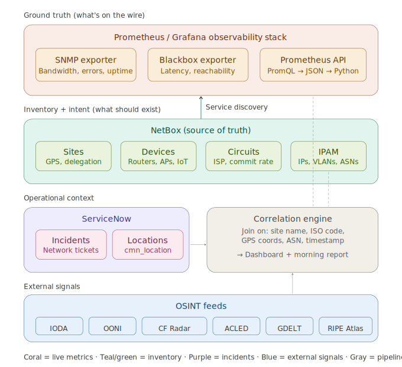

# HENRI — Humanitarian Early-warning Network Resilience Intelligence

## Architecture brief

**Project**: HENRI — Field network intelligence prototype
**Team**: Head of Field IT Services · Product Owner, Networks · Software Architect (Davy)
**Organisation**: ICRC
**Status**: Phase 0 in progress — ServiceNow extraction validated, Grafana access confirmed, Prometheus labels mapped
**Last updated**: 2026-03-27

---

## 1. Why this exists

The organisation operates network infrastructure across dozens of field delegations in conflict-affected and resource-constrained regions. Today, network data is siloed: the observability team watches Prometheus dashboards, the infrastructure team maintains NetBox, the service desk tracks incidents in ServiceNow, and nobody systematically monitors the external threat landscape (internet shutdowns, BGP anomalies, conflict escalation) that affects our connectivity.

This prototype — **HENRI** — fuses these four data domains into a single intelligence layer, topped by an LLM-powered report generation tier that transforms structured findings into actionable narratives. It produces two outputs: a live dashboard and a periodic morning report written in natural language with prioritised recommendations. The goal is to move from reactive firefighting to informed, anticipatory infrastructure decisions.

---

## 2. Use cases

### UC-1: Bandwidth optimisation (ISP negotiation leverage)

Compare actual bandwidth consumption (Prometheus) against committed circuit rates (NetBox) and user/device counts (NetBox) per site. Identify delegations where bandwidth is consistently under-utilised (overpaying the ISP) or saturated (need to renegotiate for more capacity at the same price). Output: per-site utilisation scorecard with recommendations.

### UC-2: Crisis-pattern early warning

Detect the signature that precedes connectivity disruption in conflict zones. The pattern emerges across layers: ACLED shows escalating conflict events in a region → IODA/Cloudflare Radar detect ASN-level traffic anomalies in the same country → Blackbox exporter probe failures spike at affected delegations → ServiceNow ticket volume surges for the same locations. Each signal alone is noise; the conjunction is a pattern. Learn from historical correlations to detect these signatures earlier in future crises. Output: alerting dashboard with regional risk indicators.

### UC-3: Data coherence and inventory validation

Cross-reference data sources to catch drift: devices in NetBox that Prometheus can't reach, circuits marked active in NetBox but showing zero traffic in Prometheus, ServiceNow locations that don't map to any NetBox site, IoT device counts in NetBox vs DHCP lease counts in Prometheus. Output: reconciliation report flagging discrepancies.

### UC-4: Strategic infrastructure siting intelligence

When the organisation needs to decide where to place a regional network hub, a new delegation's connectivity infrastructure, or a backup path, HENRI produces a comparative analysis combining internal performance data with external infrastructure and risk intelligence. This is the use case that gets presented to directors.

**Origin**: The Head of Field IT shared a manually-produced presentation (Feb 2026) evaluating Bangkok vs Manila for the Asia-Pacific IT network hub. The analysis required weeks of manual research across submarine cable maps (TeleGeography), IXP data (OECD), latency estimates, geopolitical risk assessment (South China Sea chokepoints), natural disaster exposure, and internal ICRC operational footprint. He noted: *"the supporting analysis was very manual to find relevant sources, and even our internal data couldn't be well leveraged."*

**What HENRI automates for this use case:**

| Dimension | Manual today | HENRI source |
|---|---|---|
| IXP density and peering capacity | OECD reports, manual lookup | PeeringDB API — structured data per country |
| Submarine cable routes and landing points | TeleGeography screenshots | TeleGeography GeoJSON endpoints |
| Measured latency between candidate sites and HQ/delegations | Qualitative guesswork | RIPE Atlas API — real probe measurements; Grafana FortiGate WAN latency |
| BGP routing path diversity | Not assessed | BGPStream — ASN transit analysis |
| Geopolitical risk near cable infrastructure | Internal legal advisor narrative | ACLED conflict events near cable landing points + IODA historical outages |
| Natural disaster exposure | General knowledge | GDELT/ReliefWeb historical disaster events by country (future) |
| ICRC operational footprint and current connectivity | Internal maps, manual | Grafana delegation registry + FortiGate site status + bandwidth data |
| ISP diversity at candidate sites | Manual dashboard inspection | Grafana ICT Resilience Dashboard — ISP links per site |

Output: structured comparison report with quantified metrics, generated in minutes instead of weeks.

---

## 3. Architecture overview

The HENRI pipeline has five tiers. Prometheus sits at the top as the live signal source, NetBox provides the infrastructure context, ServiceNow and OSINT supply operational and external signals, a correlation engine joins all layers on shared keys, and an LLM intelligence layer transforms structured findings into human-readable reports with actionable recommendations.



### Tier 1 — Ground truth: Prometheus / Grafana

What's actually happening on the wire, right now and historically.

| Component | What it provides | Key metrics |
|---|---|---|
| SNMP Exporter | Per-interface metrics from routers, switches, APs, VSAT modems | `ifHCInOctets/ifHCOutOctets` (throughput), `ifOperStatus` (up/down), `ifInErrors/ifOutErrors`, `ifInDiscards/ifOutDiscards`, `sysUpTime`, interface speed (`ifHighSpeed`) |
| Blackbox Exporter | User-perspective endpoint probing over ICMP, HTTP, DNS, TCP | `probe_success` (reachable?), `probe_duration_seconds` (latency), DNS resolution time, SSL cert expiry |
| Prometheus API | Programmatic access to all stored time series | **Access via Grafana proxy only** (direct Prometheus API being restricted for security). Endpoint: `GET /api/datasources/proxy/<id>/api/v1/query_range` |

#### Confirmed label structure (verified 2026-03-27)

All field targets carry structured labels. The `location_site` label is the universal join key across all jobs:

```
instance="JUBFGT"
job="fortigate"
location_site="JUB"                          ← site code (primary join key)
region="AFRICA East"                         ← ICT region
smt_assignmentgroup="JUB ICT L2 SUPPORT"     ← matches ServiceNow assignment_group exactly
smt_appservice="SNSVC0006587"                ← ServiceNow application service ID
```

#### Confirmed Prometheus jobs

| Job | Targets | What it monitors | Has `location_site`? |
|---|---|---|---|
| `fortigate` | ~200 sites | Firewall/gateway — site up/down, WAN latency, VPN tunnels | ✅ + `region` + `smt_assignmentgroup` |
| `audiocodes` | ~100 sites | VoIP gateways — telephony quality, ping | ✅ |
| `cisco` | HQ (GVA) | Core network switches | ✅ |
| `fortivpn` | HQ (GVA) | VPN concentrator | ✅ |
| `fortianalyzer` | HQ (GVA) | Log analysis appliance | ✅ |
| `solidserver_snmp` | HQ (GVA) | DNS/IPAM appliance (EfficientIP) | ✅ |

#### Confirmed: bandwidth data carries site labels

`ifHCInOctets` is available for ~100 sites with `location_site` labels. Downsampled recording rules exist (`ifHCInOctets:downsampled`, `ifHCOutOctets:downsampled`), indicating long-term storage is in place.

**Critical PromQL queries for our use cases (confirmed working):**

```promql
# Bits per second inbound at a site (UC-1)
rate(ifHCInOctets{location_site="JUB"}[1h]) * 8

# Utilisation as % of link capacity (UC-1) — needs ifHighSpeed from same target
rate(ifHCInOctets{location_site="JUB"}[1h]) * 8 / ifHighSpeed / 1e6 * 100

# FortiGate site up/down status (UC-2)
up{job="fortigate", region="AFRICA East"}

# Build delegation registry from Prometheus labels
group by (location_site, region, smt_assignmentgroup) (up{job="fortigate"})
```

#### Grafana dashboards (confirmed accessible)

Under `Dashboards > Field`:

| Folder / Dashboard | Relevance |
|---|---|
| **Management Dashboard** → ICT Resilience Dashboard | Per-site resilience score (78% for ABJ), ISP links (MAINONE, MTN, Layer 3, STARLINK), device status, WiFi client count, UPS uptime |
| **Fortinet** | FortiGate WAN metrics, firewall status — core of UC-1 and UC-2 |
| **IOT** | Device counts, IoT gateway status — user density for UC-1 |
| **Field Electricity** | Power/UPS data — contextual signal (power cuts precede network loss) |
| **Starlink** | Satellite backup link performance — ISP diversity |
| **Audiocodes SBC** | VoIP quality metrics |
| **Service Now & Incidents Automation** | Existing ServiceNow ↔ Grafana integration (investigate) |
| **Global View / Regional View** | Aggregated views across sites and regions |
| **Site Critical Elements** | Per-site critical infrastructure status |
| **Multiple Site Network status and Server alert** | Multi-site comparison view |

**Access status**: 🟢 **Grafana access confirmed.** Viewer-level access with dashboard browsing. Grafana API service account with Viewer role requested (pending). Direct Prometheus access is temporary — will be restricted; Grafana proxy is the long-term path.

---

### Tier 2 — Inventory and intent: NetBox

The single source of truth for what infrastructure *should* exist and how it's configured.

**What NetBox is**: An open-source IPAM (IP Address Management) and DCIM (Data Center Infrastructure Management) platform. It serves as the authoritative inventory of all network infrastructure — physical and logical. Originally built by DigitalOcean, now maintained by NetBox Labs (18k+ GitHub stars, current release v4.5.x).

**What it stores and why it matters for us:**

| NetBox module | Data | How we use it |
|---|---|---|
| DCIM — Sites | Field offices, camps, health facilities with GPS coordinates, physical addresses, regional grouping | **Join key** to correlate Prometheus metrics, ServiceNow tickets, and OSINT events to physical locations |
| DCIM — Devices | Routers, switches, APs, IoT gateways with manufacturer, model, serial, firmware, status (active/planned/offline) | Device counts per site for UC-1 capacity planning; inventory validation for UC-3 |
| Circuits | ISP providers, circuit types (VSAT, fiber, 4G, microwave), committed bandwidth rate (CIR), A/Z terminations at sites | **Committed rate** is the denominator for utilisation calculations in UC-1 |
| IPAM | IP addresses, prefixes (subnets), VLANs, VRFs, ASNs | ASN mapping enables correlation with IODA/OONI data in UC-2; IP ranges enable cross-ref with Prometheus targets |
| Tenancy | Resource assignment to programs or partner orgs (UNHCR, WFP, MSF) | Context for multi-tenant sites |
| Wireless | WiFi SSIDs, point-to-point links | Wireless capacity data |
| Custom fields | IoT-specific attributes (firmware version, SIM ICCID, power source: solar/grid/battery) | IoT asset tracking, cross-validation in UC-3 |

**API access**: Full REST API at `/api/` with token auth, plus a read-only GraphQL API at `/graphql/`. Supports filtering (`?site=kakuma&status=active`), field selection (`?fields=name,status`), and brief mode (`?brief=true`).

**Integration with Prometheus**: The `netbox-plugin-prometheus-sd` plugin turns NetBox into a Prometheus service discovery source. Devices tagged for monitoring automatically appear as Prometheus targets with metadata labels (site, role, tenant). This is the bridge between Tier 1 and Tier 2 — and the reason some observability data originates from NetBox.

**Access status**: 🔴 Not yet available. Awaiting credentials.

---

### Tier 3a — Operational context: ServiceNow

Where humans report that something is broken — and where Prometheus auto-files alerts. This is the first data source we have access to, and the initial analysis reveals it's far richer than expected.

**Access status**: 🟢 **CSV export confirmed working.** URL-based CSV export from list views is available. PA dashboard also accessible. CMDB CI table (cmdb_ci_ip_switch) is **not accessible** (empty export).

**Extraction method**: URL-based CSV export via authenticated browser session:
```
https://<instance>.service-now.com/incident_list.do?CSV
  &sysparm_query=<encoded_filter>
  &sysparm_fields=sys_id,number,short_description,priority,urgency,impact,
   state,category,subcategory,opened_at,resolved_at,closed_at,location,
   cmdb_ci,assignment_group,sys_updated_on
```
Default export limit is 10,000 rows per request (workaround: batch by date range using `opened_at>=YYYY-MM-DD^opened_at<YYYY-MM-DD`). Playwright automation needed only for the SSO login flow; the CSV download itself is a direct URL hit.

#### Key findings from initial data analysis (50,000 incidents, Nov 2025 – Mar 2026)

**Finding 1: 74% of tickets are Prometheus-automated alerts.** 37,106 of 50,000 tickets follow the pattern `? Prometheus - <HOSTNAME> - <AlertName>`. This means ServiceNow is already a structured downstream mirror of Prometheus alert data — we can extract alert types, hostnames, and delegation codes from these tickets before we even get direct Prometheus API access.

**Finding 2: The delegation code system is our primary join key.** 3-letter codes (JUB = Juba, ABJ = Abidjan, NAI = Nairobi, etc.) appear consistently in two places:
- Assignment groups: `JUB ICT L2 Support`, `ABJ ICT L2 Support` — 201 distinct delegation codes found
- Prometheus hostnames: `KADFGT` = KAD (Kaduna) + FGT (FortiGate), `LSHSPM01` = LSH (Lesotho) + SPM (device type)

These codes are more reliable than the `location` field (0.0% fill rate) or `cmdb_ci` (0.6% fill rate).

**Finding 3: Network-critical alerts are clearly identifiable.**

| Prometheus alert | Count | Significance |
|---|---|---|
| `FortigateSiteDown` | 2,243 | **Entire delegation offline** — the primary UC-2 signal |
| `LdapBindLatencyCritical` | 4,001 | Authentication latency — affects all users at a site |
| `FortigateWanLatencyDeviation` | 104 | WAN link quality degrading — ISP/connectivity issue |
| `AudiocodesPingDown` | 419 | VoIP gateway down — telephony affected |
| `DhcpHighDHCPAddressUsageByScope` | 152 | DHCP pool near exhaustion — proxy for device count pressure |
| `VmwareHostHighDroppedPacketsRx` | 982 | Network packet loss on hypervisor hosts |

**Finding 4: Human-filed tickets are multilingual and capture user experience.** 12,894 human tickets (26%), of which ~830 are network-related. Languages include English, French ("problème de connexion"), and Spanish ("problemas con internet"). These represent the lived user impact that automated alerts miss.

**Finding 5: Incident categories are coarse-grained.** The dominant category is "Degraded Service" (83.6%) with subcategories mostly empty (99.5%). Meaningful classification must come from parsing the `short_description` field rather than relying on category/subcategory.

**Finding 6: The PA dashboard organises data by ICT Region.** Six regions visible: AMERICAS, AFRICA EAST, AFRICA WEST, NAME (North Africa / Middle East), EURASIA, ASIA. Monthly incident volumes range from ~50-100 (Americas) to ~400-520 (Africa East). The dashboard also supports filtering by Assignment Group, Region, Country, and Site.

**Finding 7: Location data exists but needs cleanup.** The `cmn_location` table has 2,252 entries across 66 countries, with GPS coordinates on 41% (922 entries). Country names are inconsistent ("Mali" vs "Mali | Mali", "Cameroon" vs "CAMEROON" vs "Cameroon | Cameroun"). The parent hierarchy has 79% fill rate, enabling a location tree. This table is the bridge to NetBox sites — fuzzy matching on name + country + GPS proximity.

#### ServiceNow data model for the pipeline

| Field | Column | Fill rate | Use |
|---|---|---|---|
| Unique ID | `sys_id` | 100% | Primary key, deduplication |
| Ticket ID | `number` | 100% | Human-readable reference |
| Description | `short_description` | 100% | Parse for: alert type, hostname, delegation code, keywords |
| Priority | `priority` | 100% | 99.7% are "4 - Low" (automated); human tickets vary |
| State | `state` | 100% | Canceled (63.6%), Closed (31.7%), Resolved (3.5%), Active (1.2%) |
| Category | `category` | 99.96% | Coarse: "Degraded Service" dominates. Not useful for filtering. |
| Opened at | `opened_at` | 100% | Timestamp for time-series analysis |
| Resolved at | `resolved_at` | ~35% | Time-to-resolution for SLA analysis |
| Assignment group | `assignment_group` | ~98% | **Delegation code extraction** (first 3 chars of L2 groups) |
| Location | `location` | 0.0% | Effectively empty on incidents — use delegation codes instead |
| CMDB CI | `cmdb_ci` | 0.6% | Sparse — not useful until CMDB access is granted |

---

### Tier 3b — Correlation engine

The pipeline component that joins all four tiers on shared keys and produces the dashboard and reports.

**Join keys:**

| Key | Sources it connects | Status | Notes |
|---|---|---|---|
| **`location_site` (3-letter code)** | Prometheus (all jobs) ↔ Grafana dashboards ↔ ServiceNow `assignment_group` | ✅ **Confirmed universal key** | Present on every Prometheus job with identical values. Maps exactly to ServiceNow L2 group prefix. Auto-populated via `group by (location_site, region, smt_assignmentgroup) (up{job="fortigate"})` — no manual curation needed. ~220 sites on FortiGate, ~100 on Audiocodes. |
| **`region` (ICT Region)** | Prometheus FortiGate labels ↔ ServiceNow PA dashboard ↔ Grafana REGION dropdown | ✅ **Confirmed** | Seven values: AMERICAS, AFRICA East, AFRICA West, NAME, EURASIA, ASIA, HQ. Present as a label on FortiGate targets. |
| **`smt_assignmentgroup`** | Prometheus ↔ ServiceNow `assignment_group` | ✅ **Confirmed exact match** | Prometheus carries the full ServiceNow assignment group string. Direct join, no fuzzy matching. |
| ISO country code | All OSINT sources ↔ `cmn_location` country field ↔ NetBox site country | 🟡 Needs mapping | Normalise "Mali \| Mali" → MLI, using `pycountry` library. Bridge from `location_site` → country via delegation registry. |
| GPS coordinates | `cmn_location` (41% fill) ↔ NetBox sites ↔ ACLED events ↔ OONI probes | 🟡 Partial | Spatial binning against COD admin boundary polygons from HDX |
| ASN | NetBox IPAM (when available) ↔ IODA ↔ OONI ↔ Cloudflare Radar | 🔴 Pending NetBox | Enrich NetBox circuit ISPs with their ASNs |
| Timestamps | All sources | ✅ Available | Daily granularity for correlation; hourly for real-time dashboard |

**Implementation**: Python service running on OpenShift (containerised), with a docker-compose fallback for laptop demos. Likely stack: FastAPI for the API layer, scheduled jobs for data pulls, PostgreSQL or SQLite for the local data store, Pandas/Polars for data transformation.

---

### Tier 4 — External signals: OSINT feeds

External data that provides context about the broader connectivity and security environment affecting our field sites.

#### Geopolitical / network measurement

| Source | What it provides | API | Free? | Update frequency |
|---|---|---|---|---|
| **IODA** (Georgia Tech) | Macroscopic internet outage detection using BGP (visible prefix count), active probing (reachable /24 blocks), and network telescope. Country and ASN-level. 5-minute resolution. | Signals: `api.ioda.inetintel.cc.gatech.edu/v2/signals/raw/{entityType}/{entityCode}` · Outage alerts: `/v2/outages/alerts?entityType=country&entityCode={CC}` · Outage summary (ranked by severity): `/v2/outages/summary?entityType=country&orderBy=score/desc` · Entity lookup: `/v2/entities/query?entityType=asn&relatedTo=country/{CC}` · ⚠ Events endpoint (`/v2/outages/events`) intermittently returns 500. | Yes, no auth | ~5 min |
| **OONI** | Crowdsourced censorship measurement: website blocking, app blocking (WhatsApp, Telegram, Signal), middlebox detection. Per-country, per-ASN. | `api.ooni.io` + S3 bulk | Yes | Daily (API) |
| **Cloudflare Radar** | Traffic anomaly detection, DDoS stats, BGP routing events. Outage Center (CROC) archives verified events. | `api.cloudflare.com/client/v4/radar/` | Yes (free token) | Near real-time |
| **RIPE Atlas** | Active measurements (ping, traceroute, DNS, HTTP) from 12,000+ hardware probes worldwide. | `atlas.ripe.net/api/v2/` + WebSocket streaming | Yes (read) | Real-time |
| **BGPStream** (CAIDA) | Real-time and historical BGP analysis — prefix hijacks, route leaks, outages. | Python/C library (PyBGPStream) | Yes (BSD) | Real-time |
| **Internet Society Pulse** | Curated shutdown tracking, Internet Resilience Index (25+ metrics/country), NetLoss economic impact calculator. | API (key required) | Yes (account) | Varies |

#### Infrastructure intelligence

| Source | What it provides | API | Free? |
|---|---|---|---|
| **PeeringDB** | IXP data, network peering policies, colocation facilities. | `peeringdb.com/api/` (JSON, 1 req/sec) | Yes |
| **TeleGeography** | Submarine cable maps and landing points. | Semi-public GeoJSON endpoints | Partial (full data is commercial) |

#### Conflict and humanitarian data

| Source | What it provides | API | Free? | Update frequency |
|---|---|---|---|---|
| **ACLED** | Geo-located conflict events (battles, protests, violence against civilians) with fatality counts, actor info, precise lat/long. 100% GPS coverage. | Auth: `acleddata.com/oauth/token` · Data: `acleddata.com/api/acled/read` (JSON/CSV) | Yes (registration, OAuth) | Weekly |
| **GDELT** | Global news monitoring in 65 languages, events coded on CAMEO taxonomy, tone analysis. | `api.gdeltproject.org/api/v2/` | Yes, no auth | 15 min |
| **HDX HAPI** | Aggregates ACLED, food security (IPC), displacement (IOM DTM), funding data. Standardised with ISO3 codes and UN p-codes. | `hapi.humdata.org/api/v1/` | Yes (app ID) | Daily |
| **ReliefWeb** | Curated humanitarian situation reports from 4,000+ sources. | `api.reliefweb.int/v2/` | Yes (appname param) | Continuous |
| **Access Now STOP** | Dataset of 1,754+ documented internet shutdowns since 2016. | CSV download | Yes | Annual |

**The gap this prototype fills**: Academic research has demonstrated that conflict events and network disruptions are causally linked (Gohdes 2015, Rydzak 2020, Miner 2025). The 2022 Iran multi-stakeholder report by OONI, IODA, Cloudflare, and others represents the gold-standard methodology. But no production tool or platform programmatically fuses conflict event datasets with network measurement data. We build that.

---

### Tier 5 — LLM intelligence layer

The last mile of the pipeline: transforming structured findings into actionable intelligence that a Head of Field IT can act on at 8am without interpreting dashboards.

#### Design principle: deterministic pipeline, generative narration

The LLM does **not** belong in the data pipeline. It should not pull from APIs, parse CSVs, or compute utilisation percentages — that's deterministic work where precision and reproducibility matter. Python does it better, cheaper, and faster.

The LLM sits between the correlation engine's structured output and the human reader. The pipeline produces a JSON payload of anomalies, metrics, patterns, and contextual data. The LLM transforms that into a narrative report with prioritised recommendations.

#### Three LLM functions

**Function 1 — Analytical narration**: Turning numbers into meaning.

Raw finding: `{"site": "Bangui", "avg_utilisation_30d": 0.12, "committed_rate_mbps": 50, "circuit_type": "fiber", "isp": "Orange"}`

LLM output: *"Bangui delegation has averaged 12% utilisation over the past 30 days against a 50 Mbps committed rate from Orange (fiber). This circuit is significantly over-provisioned — recommend opening renegotiation for either a lower-tier commitment or price reduction."*

**Function 2 — Pattern synthesis**: Connecting dots across tiers that rule-based logic would miss.

Raw findings: ACLED armed clashes near Maiduguri (72h) + IODA 30% prefix drop for AS37148 + Blackbox 60% packet loss from Maiduguri + 4 new P2 ServiceNow tickets.

LLM output: *"Maiduguri shows a converging disruption pattern: escalating conflict activity within 40km over the past 72 hours coincides with a 30% drop in routed prefixes for the local ISP and degrading connectivity from our delegation. This matches the pre-disruption signature observed before the [previous incident in region]. Recommend activating backup VSAT link and pre-positioning the regional IT response team."*

**Function 3 — Ticket semantic analysis**: Classifying ServiceNow incident descriptions into finer-grained categories than the structured fields allow.

Ticket: `"internet not working in Maiduguri office since morning, even mobile hotspot is slow"`

LLM classification: `{"category": "external_disruption", "confidence": 0.85, "reasoning": "Both fixed and mobile connectivity affected suggests ISP/regional issue, not local equipment", "entities": ["Maiduguri", "internet", "mobile hotspot"]}`

This classification feeds back into the correlation engine's pattern detection for UC-2, enriching the signal before the report is generated. It can run on a smaller, lighter model than Functions 1 and 2.

#### Pipeline architecture

```
┌──────────────────────────────────────────┐
│  Correlation engine (Python)             │
│  Produces: structured_findings.json      │
│  ┌──────────────────────────────────┐    │
│  │ anomalies[]                      │    │
│  │ utilisation_scores[]             │    │
│  │ incident_surges[]                │    │
│  │ osint_signals[]                  │    │
│  │ pattern_matches[]                │    │
│  │ ticket_classifications[]  ◄──┐   │    │
│  └──────────────────────────────┼───┘    │
│                                 │        │
│  ┌──────────────────────────────┴───┐    │
│  │ Ticket classifier (Function 3)   │    │
│  │ Lightweight LLM or fine-tuned    │    │
│  │ small model on each ticket batch │    │
│  └──────────────────────────────────┘    │
└────────────────┬─────────────────────────┘
                 │
                 ▼
┌──────────────────────────────────────────┐
│  Report prompt builder (Python)          │
│                                          │
│  Assembles for each report run:          │
│  ├─ System prompt (role, tone, format)   │
│  ├─ Structured findings (JSON)           │
│  ├─ Site/circuit reference data          │
│  ├─ Historical baselines for comparison  │
│  └─ Previous report (for continuity)     │
│                                          │
│  The prompt builder is the key           │
│  engineering artefact. It controls       │
│  what the LLM sees and how it reasons.   │
└────────────────┬─────────────────────────┘
                 │
                 ▼
┌──────────────────────────────────────────┐
│  LLM inference (abstracted endpoint)     │
│                                          │
│  Interface: send(messages) → text        │
│  Swappable backends:                     │
│  ├─ Claude API (prototype phase)         │
│  ├─ Local model via Ollama (CPU)         │
│  └─ Local model via vLLM (GPU, prod)     │
│                                          │
│  The abstraction ensures the prompt      │
│  builder and report pipeline work        │
│  identically regardless of backend.      │
└────────────────┬─────────────────────────┘
                 │
                 ▼
┌──────────────────────────────────────────┐
│  Report output                           │
│  ├─ HTML morning briefing (scheduled)    │
│  ├─ On-demand deep-dive reports          │
│  ├─ Alert narratives (triggered)         │
│  └─ Human review → feedback loop         │
│     (domain experts validate, correct,   │
│      and refine; findings feed back      │
│      into prompt builder tuning)         │
└──────────────────────────────────────────┘
```

#### LLM migration path

**Prototype (now → 3 months)**: Claude API via the Anthropic Python SDK. Fastest path to a working report generator. Quality high enough to validate with stakeholders. The structured-findings-in / report-out pattern means sensitive data exposure is controllable — we send aggregated metrics and anonymised findings, not raw logs or network topology details.

**Production — local model**: Deploy on OpenShift to keep all data on-premises. Realistic options for report-quality generation:

| Option | Hardware required | Latency | Quality for our use case |
|---|---|---|---|
| Llama 3.1 70B (vLLM) | 1-2 GPUs (A100/H100 or equivalent) | 5-15s per report | High — strong analytical reasoning |
| Mistral Large (vLLM) | Similar GPU requirement | 5-15s | High — good structured output |
| Llama 3.1 8B quantised (Ollama) | CPU-only, 16GB+ RAM | 30-90s per report | Adequate for Function 3 (ticket classification); may struggle with Function 2 (complex pattern synthesis) |
| Fine-tuned small model | CPU or modest GPU | 10-30s | Potentially strong if fine-tuned on our domain reports |

**Hybrid option**: Local model for routine morning reports (data stays on-prem, latency acceptable for scheduled jobs) + Claude API for on-demand deep-dive analysis (user explicitly triggers, understands the data flow). This respects data governance while preserving quality for complex analytical queries.

**The key engineering decision**: Build the inference abstraction from day one. The prompt builder produces a list of messages. The inference layer accepts messages and returns text. Swapping Claude for a local model is a config change, not a rewrite.

#### Prompt builder design principles

The prompt builder is the most important engineering artefact in this tier. It assembles the full context window for each report run:

1. **System prompt**: Defines the LLM's role (humanitarian network intelligence analyst), tone (professional but direct, no hedging on clear findings), output format (structured sections: executive summary, per-region breakdown, recommendations, open questions), and constraints (never invent data, always cite which data source supports each finding).

2. **Structured findings**: The JSON payload from the correlation engine. This is the primary input — everything the LLM needs to narrate is here. No raw time series data, no full ticket dumps — only pre-processed, aggregated findings.

3. **Reference data**: Site names, ISP names, circuit types, device counts — the factual context that makes the narrative specific and actionable rather than generic.

4. **Historical baselines**: Previous period's metrics for comparison. "Utilisation increased from 12% to 45%" is more useful than "utilisation is 45%."

5. **Previous report**: Enables narrative continuity. The LLM can track developing situations ("As noted in yesterday's report, Maiduguri connectivity continues to degrade...") and acknowledge resolved issues ("The Bangui latency spike reported on Monday has resolved following the ISP maintenance window").

6. **Human feedback loop**: Domain experts review reports, flag inaccuracies, and highlight missed patterns. This feedback is captured and used to refine the system prompt, adjust finding thresholds, and — in the local model phase — potentially fine-tune the model on approved report examples.

---

## 4. Deployment

**Target**: On-premises OpenShift cluster.
**Demo**: Must also run from a laptop via docker-compose.

This means all components must be containerised. The architecture should be a set of independently deployable services (data collectors per source, correlation engine, dashboard frontend, report generator) communicating through a shared data store.

---

## 5. Implementation phases

### Phase 0 — ServiceNow data pipeline (NOW — IN PROGRESS)

CSV export is confirmed working. The initial 50k-row export has been analysed. The data is far richer than expected: 74% of tickets are structured Prometheus alerts with parseable hostnames encoding delegation codes and alert types.

**Phase 0a: Extraction toolkit**
- [ ] Playwright script for SSO authentication + session persistence
- [ ] CSV export scheduler: batched date-range downloads to handle 10k-row limit
- [ ] Incremental extraction using `sys_updated_on>=<last_run>` filter
- [ ] Location table (`cmn_location`) export and cleanup

**Phase 0b: Parsing and enrichment**
- [ ] Prometheus ticket parser: extract delegation code, device type, and alert name from `short_description` using regex on pattern `? Prometheus - <HOSTNAME> - <AlertName>`
- [ ] Delegation code registry: **auto-populated from Grafana** by querying `group by (location_site, region, smt_assignmentgroup) (up{job="fortigate"})` — gives us ~220 site codes with region and assignment group mappings for free. Enrich with GPS coordinates from `cmn_location` via site code → city fuzzy match.
- [ ] Human ticket classifier: multilingual keyword extraction (EN/FR/ES) to tag network-related human tickets
- [ ] Location table normaliser: deduplicate country names ("Mali" vs "Mali | Mali"), fill missing GPS via geocoding of city+country

**Phase 0c: Baseline analysis and first report**
- [ ] Time-series: `FortigateSiteDown` events by delegation and by ICT region, daily and weekly aggregation
- [ ] Surge detection: identify clusters where multiple delegations in the same region go down within the same time window (UC-2 precursor signal)
- [ ] Ticket volume baseline: monthly volumes per delegation and per ICT region, compared against dashboard data for validation
- [ ] Incident duration analysis: time-to-resolution for network alerts by region
- [ ] First baseline report (HTML): per-region summary with site-down heatmap, top alerting delegations, and human ticket keyword cloud

### Phase 0.5 — Grafana API integration (NOW — ACCESS CONFIRMED)

Grafana Viewer access confirmed. The ICT Resilience Dashboard and Field folder dashboards are accessible. Grafana becomes the primary interface for live metrics now that direct Prometheus is being cut.

**Deliverables:**
- [ ] Grafana API client: authenticate with service account token, discover data sources, proxy PromQL queries
- [ ] Delegation registry enrichment: query FortiGate targets to auto-populate site code → region → assignment group mapping
- [ ] Bandwidth data pull: `rate(ifHCInOctets{location_site="<site>"}[1h]) * 8` for all sites, via Grafana proxy
- [ ] Resilience score extraction: pull the per-site resilience percentage from the ICT Resilience Dashboard (either via panel query or dashboard API)
- [ ] ISP link inventory: extract ISP provider names per site from the Grafana dashboard data (MAINONE, MTN, Starlink, etc.)
- [ ] WiFi client counts per site: extract `active` / `down` AP counts and client count from the dashboard
- [ ] Dashboard JSON export: archive all Field dashboard definitions for query reverse-engineering

### Phase 1 — NetBox integration and UC-1 MVP (WHEN NETBOX ACCESS GRANTED)

Grafana gives us live metrics. NetBox gives us the denominator: committed circuit rates, device inventories, and the intended infrastructure state. Together they unlock UC-1.

**Deliverables:**
- [ ] NetBox API client: pull sites, devices, circuits (ISP + committed rate), IPAM data
- [ ] UC-1 bandwidth scorecard: `actual_throughput / committed_rate` per site, combining Grafana bandwidth data with NetBox circuit CIR values
- [ ] Per-user bandwidth: Grafana throughput ÷ (NetBox device count or Grafana WiFi client count) per site
- [ ] Cross-validation (UC-3): NetBox active devices vs Prometheus reachable targets, NetBox active circuits vs Grafana non-zero interfaces
- [ ] Canonical site mapping table: NetBox site ↔ ServiceNow `cmn_location` ↔ Prometheus `location_site` — should be near-trivial since `location_site` codes are consistent everywhere

### Phase 2 — OSINT ingestion

Start with IODA + ACLED + Cloudflare Radar as the core OSINT triad. All three APIs have been validated with test data in `data/fixtures/`.

**Deliverables:**
- [ ] IODA client: pull outage summary (`/v2/outages/summary` — ranked countries by severity), outage alerts (`/v2/outages/alerts` — per-country anomaly detections with critical/normal transitions), raw signals (`/v2/signals/raw/{entityType}/{entityCode}` — 5-min resolution BGP/ping/telescope), and ASN discovery (`/v2/entities/query?entityType=asn&relatedTo=country/{CC}`)
- [ ] ACLED client: pull conflict events by country and date range via OAuth (`acleddata.com/api/acled/read`). Handle 5,000-row pagination. Key fields: `event_date`, `country`, `latitude`, `longitude`, `event_type`, `fatalities`
- [ ] Cloudflare Radar client: pull CROC outages (`/radar/annotations/outages`), NetFlows per country (`/radar/netflows/timeseries`), BGP hijacks (`/radar/bgp/hijacks/events`), BGP leaks (`/radar/bgp/leaks/events`)
- [ ] Correlation prototype: ACLED conflict escalation × IODA outage alerts × Cloudflare outages × ServiceNow FortigateSiteDown surges, joined on ISO country code + timestamp windows
- [ ] Access Now STOP dataset as ground-truth validation for the correlation model

### Phase 3 — LLM report generation (MVP)

Build the prompt builder and inference abstraction. Start with Claude API for rapid iteration.

**Deliverables:**
- [ ] Inference abstraction layer: swappable backend (Claude API now, local model later)
- [ ] Prompt builder: assembles system prompt + structured findings + reference data + previous report
- [ ] Function 3 (ticket classifier): lightweight LLM call to classify ServiceNow ticket descriptions into fine-grained categories; feeds back into correlation engine
- [ ] Morning report generator: scheduled job → structured findings → prompt builder → LLM → HTML output
- [ ] On-demand deep-dive: user-triggered report for a specific site or region
- [ ] Sample system prompt refined through iteration with domain experts

### Phase 4 — Dashboard, alerting, and refinement

**Deliverables:**
- [ ] Live dashboard (likely Grafana with custom panels, or a lightweight web app)
- [ ] Alerting rules for UC-2 early warning patterns, with LLM-generated alert narratives
- [ ] Human feedback loop: domain experts review reports, flag inaccuracies, highlight missed patterns
- [ ] Feedback capture mechanism that feeds corrections back into prompt builder tuning
- [ ] Evaluation of local model options for on-prem deployment (benchmark Llama/Mistral against Claude output quality on our specific report format)

### Phase 5 — Local LLM migration (WHEN READY)

**Deliverables:**
- [ ] Local model deployment on OpenShift (Ollama for CPU-only, vLLM if GPU available)
- [ ] Quality benchmarking: local model vs Claude API on a curated set of report scenarios
- [ ] Hybrid routing: local model for scheduled morning reports, Claude API (optional) for complex on-demand analysis
- [ ] Fine-tuning pipeline (if warranted): use approved report examples as training data for a domain-adapted small model

---

## 6. Technical decisions (to be refined)

| Decision | Current thinking | Alternatives |
|---|---|---|
| Language | Python (data pipeline, API clients, analysis, prompt builder) | TypeScript for dashboard frontend if needed |
| Data store | PostgreSQL for structured data; possibly TimescaleDB for time series if Prometheus retention is too short | SQLite for laptop demo mode |
| Orchestration | Cron jobs initially; graduate to Airflow or Dagster if complexity warrants it | OpenShift CronJobs |
| Dashboard | Grafana (already in the stack) or custom lightweight web app | Streamlit for rapid prototyping |
| Containerisation | Docker with docker-compose for dev; OpenShift Deployment for prod | Podman (OpenShift-native) |
| Report generation | LLM narration from structured findings → HTML → optional PDF via WeasyPrint | Jinja2 templates as fallback for LLM-free mode |
| LLM (prototype) | Claude API via Anthropic Python SDK (claude-sonnet-4-20250514 for reports, claude-haiku-4-5-20251001 for ticket classification) | Any OpenAI-compatible API |
| LLM (production) | Local model on OpenShift — Llama 3.1 70B via vLLM (GPU) or 8B via Ollama (CPU) | Mistral Large; fine-tuned small model |
| LLM abstraction | Simple Python interface: `send(messages: list[dict]) → str` with backend config (claude/ollama/vllm) | LiteLLM as a unified proxy |
| Prompt management | Version-controlled prompt templates in the repo, with structured data injected at runtime | Prompt management platform (likely overkill at this stage) |

---

## 7. Open questions

1. ~~**Prometheus label structure**~~: ✅ **Confirmed 2026-03-27.** All field targets carry `location_site` (3-letter site code), `region` (ICT region), `smt_assignmentgroup` (matches ServiceNow exactly), `smt_appservice` (ServiceNow service ID). `location_site` is the universal join key across all Prometheus jobs.
2. ~~**Prometheus retention**~~: ✅ **Partial answer.** Downsampled recording rules exist (`ifHCInOctets:downsampled`), confirming long-term storage beyond default 15-day retention. Exact retention period TBD — ask observability team.
3. **NetBox version and plugins**: Still pending — no NetBox access yet.
4. ~~**ServiceNow export limits**~~: ✅ **Confirmed.** Default 10,000 rows per export. Workaround: batch by date range. CSV export works via URL, no API needed.
5. ~~**ServiceNow field access**~~: ✅ **Confirmed.** `cmdb_ci` table is NOT accessible (empty export). `cmn_location` IS accessible — 2,252 entries, 41% with GPS, 66 countries.
6. ~~**ACLED registration**~~: ✅ Davy registers with work account.
7. ~~**Cloudflare Radar token**~~: ✅ Davy registers with work account.
8. ~~**Data sensitivity and LLM data flow**~~: ✅ **All data must stay on-premises.** No cloud storage, no external SaaS analytics. This reinforces the OpenShift deployment target and rules out hosted dashboard services. For LLM usage in report generation, this means either a local model (Ollama/vLLM) or careful anonymisation before any external API call.
9. **GPU availability on OpenShift**: Is there GPU capacity on the OpenShift cluster for running a local LLM (vLLM)? If not, CPU-only inference via Ollama with a smaller quantised model is the fallback — acceptable for scheduled reports but slower.
10. ~~**Grafana API**~~: ✅ **Confirmed.** Grafana is accessible with dashboard browsing. Service account with Viewer role requested. Grafana API will be the sole path to Prometheus data (direct Prometheus access being cut). Six Prometheus jobs confirmed with `location_site` labels.
11. **Report audience and format**: Who reads the morning report? Just Field IT leadership, or also regional delegation heads? This shapes the tone, level of technical detail, and whether reports need multilingual support.
12. **Existing report workflows**: Are there existing manual reports or briefings that this would replace or supplement? Having examples of what "good" looks like helps tune the LLM prompt.

---

## 8. Glossary

| Term | Definition |
|---|---|
| **ASN** | Autonomous System Number — identifies an ISP or large network operator. The key that links NetBox circuit providers to IODA/OONI external measurements. |
| **BGP** | Border Gateway Protocol — the routing protocol of the internet. BGP anomalies (hijacks, leaks, withdrawals) are early indicators of deliberate disruption. |
| **CIR** | Committed Information Rate — the bandwidth an ISP contractually guarantees. Stored in NetBox circuit records. |
| **COD** | Common Operational Dataset — standardised geographic boundary files for humanitarian response (admin levels 0-3). Available from HDX. |
| **DCIM** | Data Center Infrastructure Management — the NetBox module for physical infrastructure. |
| **IPAM** | IP Address Management — the NetBox module for logical network resources. |
| **IXP** | Internet Exchange Point — physical location where networks peer. Tracked by PeeringDB. |
| **LLM** | Large Language Model — the AI model that generates narrative reports from structured findings. Used via API (Claude) in prototype, local deployment (Llama/Mistral) in production. |
| **Ollama** | Lightweight framework for running LLMs locally on CPU or GPU. Candidate for on-prem deployment on OpenShift. |
| **OSINT** | Open Source Intelligence — publicly available data used for situational awareness. |
| **p-code** | Place code — the UN's standardised geographic identifier for subnational administrative divisions. |
| **Prompt builder** | The pipeline component that assembles the full context (system prompt + structured data + reference data + previous report) for LLM inference. The key engineering artefact of Tier 5. |
| **PromQL** | Prometheus Query Language — used to query time series data from Prometheus. |
| **vLLM** | High-throughput LLM inference engine optimised for GPU serving. Candidate for production-grade local model deployment. |
| **VSAT** | Very Small Aperture Terminal — satellite communication technology common in remote field locations. |
